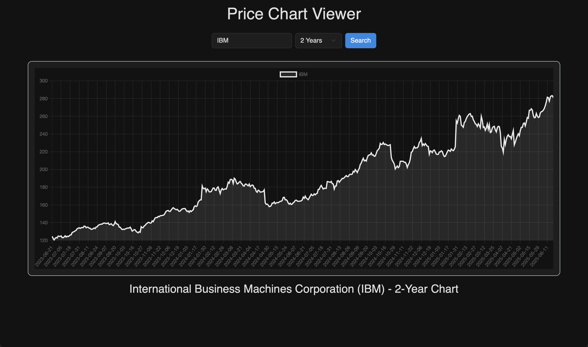

# 📈 Stock Chart Viewer
#### Video Demo: <url>
#### Description:
**Stock Chart Viewer** is a simple web app that allows you to view interactive stock price charts for different time periods. Built using Flask, Chart.js, and Yahoo Finance data, the app provides a clean UI to visualize trends for any publicly traded company.

---

## 🚀 Features

- Search for any stock by symbol (e.g., `AAPL`, `GOOG`, `MSFT`)
- View charts over various time ranges:
  - 1 Day, 1 Week, 1 Month, 3 Months, 6 Months, 1 Year, 2 Years, 5 Years, 10 Years, Max
- Dynamic line charts rendered with Chart.js
- Sleek dark mode interface

## 🛠 Tech Stack

- **Backend**: Python, Flask
- **Frontend**: HTML5, Bootstrap 5, Chart.js
- **Data Source**: yfinance (Yahoo Finance API wrapper)

## 💡 TODO / Improvements

- Add candlestick chart option
- Add volume indicators
- Add historical news data per date
- Deploy to a cloud platform (Render, Vercel, etc.)

## 📄 License

MIT License

## 🙌 Credits

- [Chart.js](https://www.chartjs.org/)
- [yfinance](https://github.com/ranaroussi/yfinance)
- [Bootstrap](https://getbootstrap.com/)
